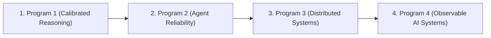

# Execution Roadmap & Gated Workflow

**Author**: Sham Satish Thakare  
**Purpose**: Step-by-step execution roadmap enforcing strict experimental gates across all 4 Primary Research Programs.

---

## 1. Execution Priority & Order

### Execution Justification
* **Program 1 (First)**: Highest experimental readiness, existing open models (Qwen2.5/Llama-3.2), low GPU cost (\$3.50), directly extends active 2025–2026 literature (*Bereket & Leskovec 2025*, *Damani et al. 2026*).
* **Program 2 (Second)**: High impact for agent security, leverages CPU/API benchmarks, addresses key Harvard/Kempner faculty interests.
* **Program 3 (Third)**: Pure C++ systems simulation on CPU (\$0.00 GPU cost), strong fit for MIT/Cornell Systems faculty.
* **Program 4 (Fourth)**: Unifies security/observability infrastructure on CPU (\$0.00 GPU cost), strong fit for MIT/Harvard Systems & Security faculty.

---

## 2. Gated Workflow Rules (Gate A to Gate F)

For every program, execution must sequentially satisfy:
- **Gate A (Existing Work Audit)**: `PASS` — Confirmed no overlap with author's prior submissions.
- **Gate B (External Novelty Audit)**: `PASS` — Confirmed 10-paper novelty matrix contains no collision score $\ge 4$.
- **Gate C (Internal Duplication Audit)**: `PASS` — Confirmed distinct scientific question in `INTERNAL_COLLISION_MATRIX.csv`.
- **Gate D (Falsifiable Hypothesis)**: `PASS` — Formulated precise $H_0$, $H_1$, mechanism, and falsifier.
- **Gate E (Cheap Pilot)**: `PASS` — Validated signal on small-scale CPU/GPU pilot before main run.
- **Gate F (Main Experiment)**: Executed main experiment across 3 matched seeds.

---

## 3. Immediate Milestone Schedule

1. **Checkpoint 1 (Completed)**: Registries built, novelty collision audited, 4 programs defined, stop before GPU expenditure.
2. **Checkpoint 2**: Preregistration and pilot design for Program 1 (RunPod L4 baseline evaluation script).
3. **Checkpoint 3**: Run minimum viable pilot (\$0.80), report ECE/Brier signal.
