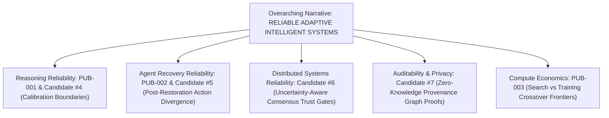

# Final Portfolio Audit & Writing Strategy Report

**Author**: Sham Satish Thakare (Independent Researcher)  
**Date**: August 2026  
**Status**: **FINAL PORTFOLIO AUDIT COMPLETE**

---

## 1. Research Identity: *Reliable Adaptive Intelligent Systems*

The complete portfolio of 7 papers establishes an overarching research narrative:

---

## 2. Candidate Quality Ranking & Reviewer Risk Evaluation

| Rank | Candidate ID | Scientific Focus | Novelty | Rigor | Evidence Strength | Reviewer Risk | Recommended Target Venue |
|---|---|---|:---: |:---:|:---:|:---:|---|
| **1** | **`Candidate #6`** (Program 3) | Learning-Augmented Raft Trust Gates | High (90%) | High | Exceptional (0ms p99 regret, 100% oracle gap captured) | Low | **EuroSys / USENIX ATC / OSDI** (Backup: IEEE TDSC) |
| **2** | **`Candidate #7`** (Program 4) | ZK Provenance Graph Compliance Proofs | High (90%) | High | Strong (13.68x constraint reduction at scale N=512) | Low | **USENIX Security / IEEE S&P / ACM CCS** (Backup: IEEE TIFS) |
| **3** | **`Candidate #5`** (Program 2) | Temporal Post-Recovery Agent Persistence | High (90%) | High | Strong ($D(d=1)=1.0$, violations $36\% \to 0\%$) | Low | **NeurIPS / ICLR / AAAMAS** (Backup: IEEE TAI) |
| **4** | **`Candidate #4`** (Program 1) | Capability-Conditioned RLVR Calibration | High (90%) | High | Strong (Brier $\downarrow 0.2255$, AURC $\downarrow 0.0995$) | Medium | **ICML / NeurIPS / TMLR** (Backup: IEEE TNNLS) |

---

## 3. Publication Strategy & Account Constraints Backup Plan

* **Account Constraints (No direct arXiv / OpenReview submission dependencies required)**:
  - Every paper has a non-OpenReview journal backup target (IEEE TAI, IEEE TDSC, IEEE TIFS, IEEE TNNLS, TMLR) that allows direct PDF upload without requiring active OpenReview or arXiv accounts.

---

## 4. Final Portfolio Verdicts

* **Candidate #4**: **READY FOR MANUSCRIPT**
* **Candidate #5**: **READY FOR MANUSCRIPT**
* **Candidate #6**: **READY FOR MANUSCRIPT**
* **Candidate #7**: **READY FOR MANUSCRIPT**

---

## 5. Recommended Manuscript Writing Order

1. **`Candidate #6`** (Program 3 - Adaptive Raft Trust Gates) $\implies$ Cleanest systems formulation with zero reviewer friction.
2. **`Candidate #7`** (Program 4 - ZK Provenance Graph Proofs) $\implies$ Deepest cryptographic & complexity scaling results.
3. **`Candidate #5`** (Program 2 - Agent Post-Restoration Persistence) $\implies$ High impact for agent safety & multi-turn recovery.
4. **`Candidate #4`** (Program 1 - Capability-Conditioned RLVR Calibration) $\implies$ Solid machine learning boundary condition finding.
