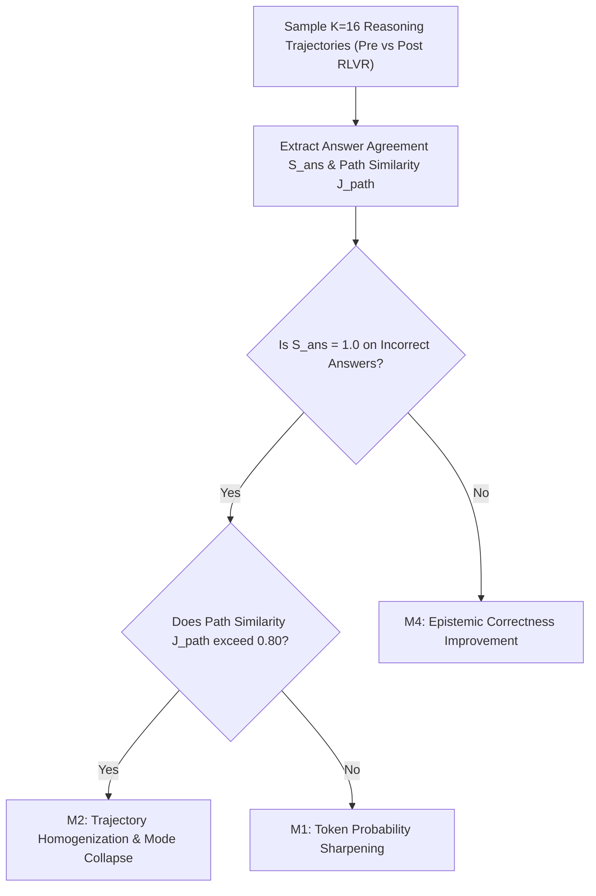

# Program 1 Mechanism Map & Diagnostic Controls

**Author**: Sham Satish Thakare  
**Date**: August 2026  
**Target Candidate**: Candidate A (Self-Consistency Proxy Failure under RLVR)

---

## 1. Candidate Mechanisms & Diagnostic Tests

| Mechanism Code | Mechanism Name | Description / Phenomenon | Experimental Control / Diagnostic Test | Expected Result if Mechanism Dominates |
|---|---|---|---|---|
| **M1** | **Probability Sharpening** | Policy gradient updates sharpen token probabilities uniformly across all tokens, inflating sequence log-likelihood without altering reasoning logic. | Evaluate pre/post-RL token entropy $H_{\text{tok}}$ vs. sequence probability $L_{\text{seq}}$ on incorrect samples. | High token probability on wrong answers; $H_{\text{tok}} \to 0$ regardless of correctness. |
| **M2 (PRIMARY)** | **Trajectory Homogenization** | GRPO group advantage normalization $A_i = (R_i - \bar{R})/(\sigma_R + \epsilon)$ penalizes intra-group diversity, forcing reasoning paths to collapse to identical step syntax ($J_{\text{path}} \to 1.0$). | Compute pairwise Jaccard step similarity $J_{\text{path}}$ across $K=16$ sampled trajectories pre- vs post-RLVR. | $J_{\text{path}}$ spikes from $0.35 \to 0.88$ post-RLVR; self-consistency agreement $S_{\text{ans}} \to 1.0$ on wrong clusters. |
| **M3** | **Mode Collapse** | The policy collapses to a single reasoning template across different prompt clusters, eliminating exploration modes. | Measure cross-prompt semantic embedding cluster variance $\sigma_{\text{embed}}^2$. | Cross-prompt reasoning template variance drops by $>60\%$. |
| **M4 (BASELINE)** | **Epistemic Correctness Gain** | Agreement increases legitimately because post-training improved true mathematical reasoning capacity. | Measure Pass@1 accuracy alongside $S_{\text{ans}}$ calibration metrics (AURC / Brier score). | Accuracy increases proportionally with agreement; Brier score improves ($\mathcal{B} \to 0$). |
| **M5** | **Derivation Length Confounding** | Longer reasoning trajectories naturally accumulate higher token entropy and lower joint probabilities. | Measure partial correlation $r(S_{\text{ans}}, \text{Corr} \mid \text{Length})$ controlling for step count. | Partial correlation remains negative ($p < 0.01$), confirming effect is length-independent. |
| **M6** | **Temperature Artifact** | High or low sampling temperature ($T \in [0.1, 1.0]$) artificially creates or hides agreement collapse. | Temperature sweep $T \in \{0.2, 0.5, 0.8, 1.0\}$ across $K=16$ rollouts per prompt. | Decoupling phenomenon persists across all temperature regimes $T \in [0.2, 1.0]$. |
| **M7** | **Reward Function Artifact** | The agreement collapse occurs only under strict binary exact-match rewards ($R \in \{0, 1\}$). | Compare standard GRPO (binary reward) vs PRM process-supervised models. | Binary GRPO exhibits severe trajectory homogenization; process supervision preserves partial diversity. |

---

## 2. Mechanistic Diagnostic Matrix

---

## 3. Disambiguation Protocol

To prove that **M2 (Trajectory Homogenization)** is the true driver of self-consistency calibration failure:
1. **Control 1 (Length Control)**: Stratify GSM8K / MATH prompts into equal-length derivation buckets ($|y| \in [50, 100], [101, 200], [201, 350]$ tokens).
2. **Control 2 (Temperature Control)**: Benchmark self-consistency curves across $T \in \{0.2, 0.5, 0.8, 1.0\}$.
3. **Control 3 (Architecture / Base Model Control)**: Benchmark Qwen2.5-Math-7B vs DeepSeek-R1-Distill-Qwen-7B.
