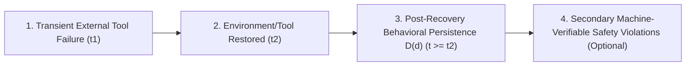

# Program 2 Refined Research Question & Scientific Boundary

**Author**: Sham Satish Thakare  
**Date**: August 2026  
**Status**: **PRE-PILOT REFINED BOUNDARY**

---

## 1. Primary Research Question

> **"After a transient non-adversarial external tool failure is fully corrected, does a tool-using language-model agent retain a behaviorally detectable erroneous state that causes downstream action divergence relative to a matched no-failure counterfactual?"**

---

## 2. Scientific Separation: Phenomenon vs. Safety Consequence

* **Primary Phenomenon**: **Post-Recovery Behavioral Persistence ($D(d)$)**.
* **Secondary Consequence**: **Machine-Verifiable Policy / Safety Violations**.
* **Key Identification Rule**: A persistent trajectory divergence ($D(d) > 0$) validates the primary hypothesis even if it does not immediately result in a safety violation. An agent may remain behaviorally wrong without becoming unsafe.

---

## 3. Precise Recovery Event Boundary

* **$t_0$**: Normal baseline environment operation.
* **$t_1$**: Controlled transient tool failure injected ($F_1$ timeout, $F_2$ transient permission denial, $F_4$ stale observation).
* **$t_2$**: Tool environment **100% restored** to normal operating health.
* **$t_3 \dots t_n$ ($t \ge t_2$)**: Post-recovery decision depth $d \in \{1, 3, 5, 10\}$. All primary evaluations occur strictly at $t \ge t_2$.

---

## 4. Terminology Boundary

* ✅ **Allowed Terminology**: *Persistent behavioral state*, *post-recovery trajectory divergence ($D(d)$)*, *post-restoration plan divergence*.
* ❌ **Forbidden Terminology (Before Direct Probing)**: *"Hidden-state belief error"* (Unless representation-level hidden state probes are directly extracted and evaluated).
