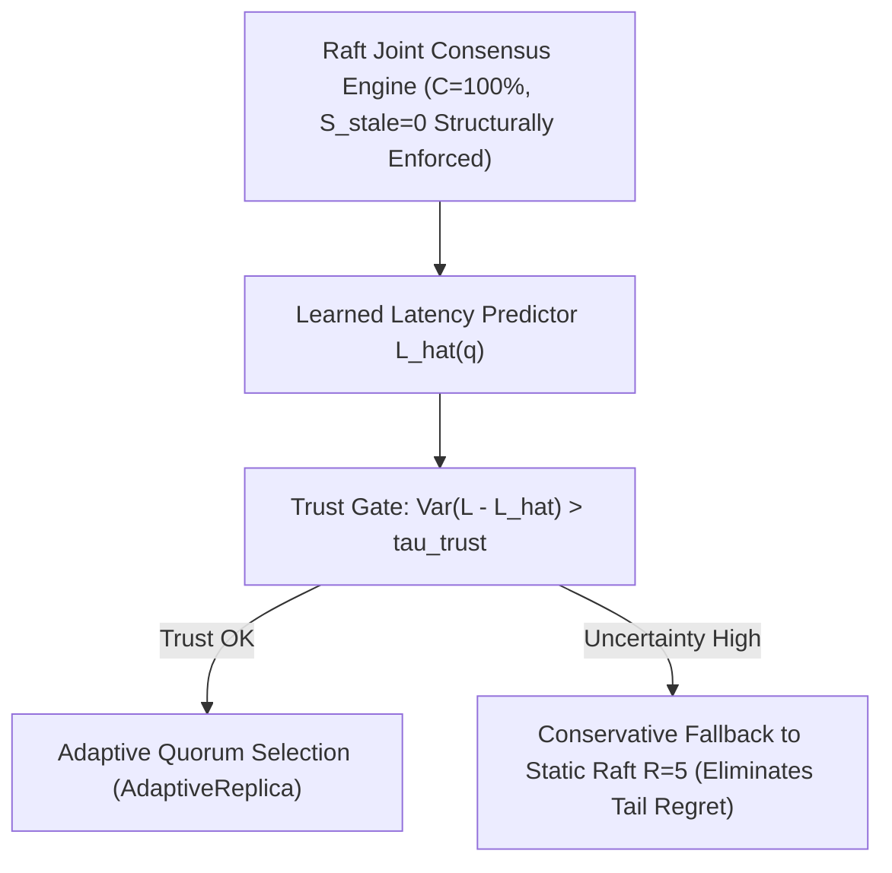

# Program 3 Refined Research Question & Scientific Boundary

**Author**: Sham Satish Thakare  
**Date**: August 2026  
**Status**: **PRE-PILOT REFINED BOUNDARY**

---

## 1. Primary Research Question

> **"Under nonstationary workload and network distribution shift, can a calibrated uncertainty-aware trust gate identify when an online learned Raft adaptation policy produces SLO-degrading tail-latency regret, and does conservative fallback bound high-tail empirical regret relative to always-adaptive control?"**

---

## 2. Controller Architecture & Protocol Invariants

* **Learned Controller Architecture**:
  - *Input Features*: Sliding-window link latency $\tau_i$, jitter $\sigma_i$, packet loss $\eta_i$, recent error residual $e_t$.
  - *Predictor Target*: Expected write latency $\hat{L}(q)$ for candidate quorum configuration $q$.
  - *Trust Signal*: Prediction residual variance $U(x) = \text{Var}(L - \hat{L})$.
  - *Conservative Fallback*: Reverting to static standard Raft majority consensus ($R=5$).
* **Protocol Invariants**: Raft joint-consensus configuration transitions ($C_{\text{old}} \to C_{\text{old,new}} \to C_{\text{new}}$) structurally guarantee $100\%$ linearizability and zero stale reads ($S_{\text{stale}}=0$). The ML controller **CANNOT cause linearizability violations**.

---

## 3. Primary Metric & Temporal Detection Metrics

* **Primary Endpoint (High-Tail Empirical Regret)**:
  $$\text{Regret}_{\text{p99}}(r) = \text{p99\_latency}_{\text{adaptive}}(r) - \text{p99\_latency}_{\text{static\_raft}}(r)$$
* **Temporal Metric (Detection Delay)**: Time elapsed (milliseconds / heartbeats) between distribution shift onset and trust-gate fallback trigger.
* **Oracle Gap Captured**:
  $$\text{OracleGapCaptured} = \frac{\text{AdaptiveRegret} - \text{GatedRegret}}{\text{AdaptiveRegret} - \text{OracleRegret}}$$
