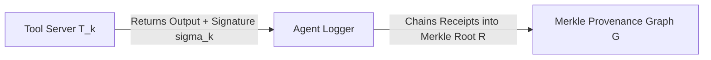

# Program 4 Commitment Completeness & Adversary Model

**Author**: Sham Satish Thakare  
**Date**: August 2026  
**Status**: **CHECKPOINT A COMPLETENESS SPECIFICATION**

---

## 1. The Commitment Completeness Problem

If an untrusted logger or agent controls the witness graph $G$ and computes $R = \text{MerkleRoot}(G)$ locally, a malicious logger could simply **omit an unauthorized tool action** (e.g. delete `E2: Auth_Failed`) before computing $R$, producing a compliant proof for an incomplete trace.

---

## 2. Tool-Signed Receipt Commitment Protocol

To guarantee **Commitment Completeness**, Program 4 incorporates tool-signed execution receipts:

1. **Tool-Signed Receipt**: When tool $T_k$ executes node $v_i$, the tool server emits a cryptographic receipt:
   $$\sigma_i = \text{Sign}_{K_{\text{tool}}}\left(H(v_i) \parallel H(\text{Parents}(v_i)) \parallel \text{Nonce}_i \parallel \text{Timestamp}_i\right)$$
2. **Chained Graph Inclusion Constraint**: The ZK circuit verifies that every executed tool node $v_i \in V$ contains a valid signature $\sigma_i$ under public key $PK_{\text{tool}}$.
3. **Completeness Guarantee**: An untrusted logger cannot delete a node $v_i$ without breaking the parent-hash chain $H(\text{Parents}(v_{i+1}))$ of downstream nodes, nor forge a non-existent tool execution without key $K_{\text{tool}}$.
