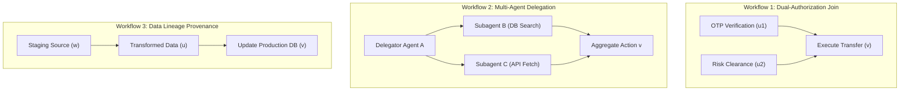
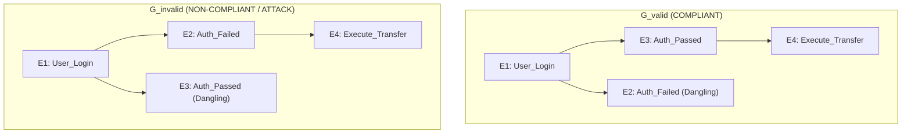

# Program 4 Graph Necessity Gate: Why a DAG is Scientifically Required

**Author**: Sham Satish Thakare  
**Date**: August 2026  
**Status**: **CHECKPOINT A GRAPH-NECESSITY SPECIFICATION**

---

## 1. Three Concrete Agent Workflows Requiring a Causal DAG

1. **Workflow 1: Parallel Dual-Authorization Join**:
   - *Requirement*: Action $v$ (Execute Transfer) requires two independent approvals: OTP Verification ($u_1$) AND Risk Clearance ($u_2$). Both $u_1 \prec_G v$ AND $u_2 \prec_G v$ must exist as parents in the causal graph.
   - *Linear Defect*: A linear log forces an artificial sequential order (e.g. $u_1, u_2, v$). If $u_1$ and $u_2$ were executed asynchronously by separate microservices, linear ordering exposes non-causal interleaving metadata.

2. **Workflow 2: Multi-Agent Subagent Delegation**:
   - *Requirement*: Agent A spawns Subagents B and C concurrently. Terminal action $v$ is valid ONLY IF causal paths exist from BOTH $B \to v$ AND $C \to v$.
   - *Linear Defect*: Linear logs conflate parallel subagent steps into a single interleaved stream, making path reachability checks ambiguous.

3. **Workflow 3: Data Lineage Origin Constraint**:
   - *Requirement*: Production write $v$ is valid ONLY IF input data node $u$ originated from an approved staging source $w$ ($w \prec_G u \prec_G v$).
   - *Linear Defect*: Linear logs cannot prove that node $v$ consumed data from $u$ rather than an unapproved intermediate node $x$ that appeared earlier in the log.

---

## 2. Formal Linear vs. Graph Counterexample ($G_{\text{valid}}$ vs $G_{\text{invalid}}$)

Consider two execution histories with identical events: `[E1: User_Login, E2: Auth_Failed, E3: Auth_Passed, E4: Execute_Transfer]`:

* **Linear Log Representation**: Both histories produce identical event logs: `[E1, E2, E3, E4]`. A linear log policy checking whether `Auth_Passed` appears before `Execute_Transfer` evaluates **TRUE for both histories!**
* **Causal Provenance DAG ($G$)**:
  - $G_{\text{valid}}$ contains edge $E_3 \to E_4$ ($E_3 \prec_G E_4$). **Policy Predicate $P(G) = \text{TRUE}$**.
  - $G_{\text{invalid}}$ contains edge $E_2 \to E_4$ ($E_2 \prec_G E_4$, deriving action from the failed auth attempt!). **Policy Predicate $P(G) = \text{FALSE}$**.
* **Scientific Proof**: A linear log **CANNOT** distinguish $G_{\text{valid}}$ from $G_{\text{invalid}}$ without revealing all intermediate edge parameters. Only a **Merkle Provenance Graph** cryptographically verifies $E_3 \prec_G E_4$ while keeping event payloads private!
