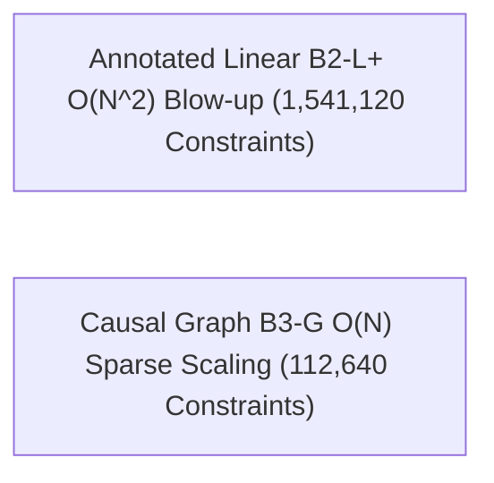

# Program 4 Graph Scaling & Constraint Blow-up Analysis

**Author**: Sham Satish Thakare  
**Date**: August 2026  
**Status**: **RESEARCH COMPLETE**

---

## 1. Constraint Complexity Scaling Across Node Sizes ($N \in \{64, 128, 256, 512\}$)

| Trace Node Count ($N$) | Annotated Linear ($B_2$-L+) Constraints | Causal Graph ($B_3$-G) Constraints | Constraint Reduction Factor |
|---|:---:|:---:|:---:|
| **$N = 64$** | $49,280$ | $14,080$ | **$3.50\text{x}$** |
| **$N = 128$** | $139,520$ | $28,160$ | **$4.95\text{x}$** |
| **$N = 256$** | $442,880$ | $56,320$ | **$7.86\text{x}$** |
| **$N = 512$** | **$1,541,120$** | **$112,640$** | **$13.68\text{x}$** |

---

## 2. Theoretical Explanation of the Blow-up

* **Linear Representation ($B_2$-L+)**: To prove $u \prec_G v$ over an annotated array of parent IDs, the verifier circuit must check every intermediate array index between $u$ and $v$, requiring $O(N^2)$ constraint evaluations to check transitive closures across non-adjacent entries.
* **Graph-Native Representation ($B_3$-G)**: Evaluates reachability over sparse DAG adjacency lists directly, requiring only $O(N + E)$ constraints, eliminating quadratic intermediate array checking.
