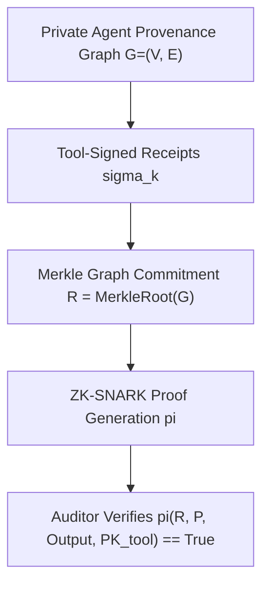

# Program 4 Refined Research Question & Cryptographic Specification

**Author**: Sham Satish Thakare  
**Date**: August 2026  
**Status**: **PRE-PILOT REFINED BOUNDARY**

---

## 1. Refined Primary Research Question

> **"Can an authenticated causal execution commitment enable zero-knowledge verification of branching authorization-path policies for tool-using agents that cannot be faithfully verified from linear audit representations without revealing protected trace attributes?"**

---

## 2. Cryptographic Proof Statement & Variable Definitions

* **Public Inputs ($X_{\text{public}}$)**:
  - Merkle Graph Commitment Root $R = \text{MerkleRoot}(G)$
  - Policy Automaton / Predicate $P$ (Authorization-Path Compliance rule: $u_1, u_2 \prec_G v$)
  - Tool Public Keys $PK_{\text{tool}}$
  - Disclosed Terminal Action / Output
* **Private Witness ($W_{\text{private}}$)**:
  - Complete execution graph $G = (V, E)$
  - Intermediate prompt text, tool parameters, API payloads, user credentials
  - Merkle inclusion paths and tool-signed receipts $\sigma_k$
* **Proof Statement ($\pi$)**:
  $$\text{Verify}(R, P, \text{Output}, PK_{\text{tool}}, \pi) \implies \exists \, G \text{ s.t. } \text{MerkleRoot}(G) = R \, \land \, P(G) = \text{True} \, \land \, \text{VerifySigs}(G, PK_{\text{tool}}) = \text{True}$$

---

## 3. Core Scientific Justification

* **Linear Representation Defect**: Linear audit logs conflate asynchronous, multi-agent, and parallel tool executions into an artificial sequential list, failing to distinguish $G_{\text{valid}}$ from $G_{\text{invalid}}$ without revealing all intermediate edge parameters.
* **Graph Necessity**: A **Merkle Provenance Graph** cryptographically verifies causal reachability ($u_1, u_2 \prec_G v$) over non-linear execution DAGs while completely hiding protected prompt texts, tool parameters, and intermediate API payloads.
