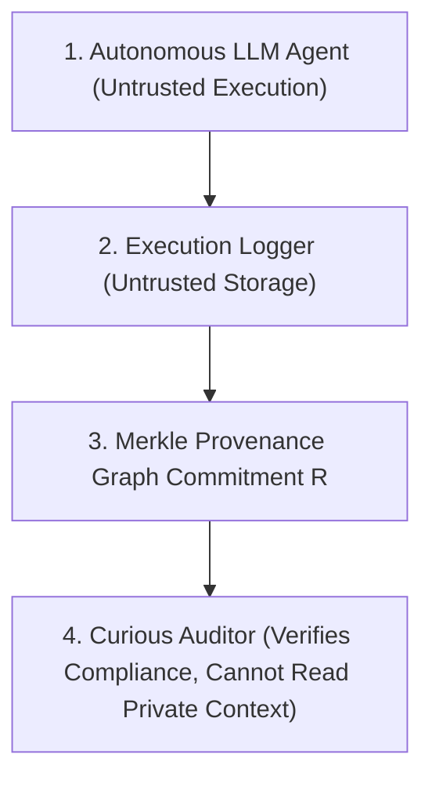

# Program 4 Threat Model & Security Formulation

**Author**: Sham Satish Thakare  
**Date**: August 2026  
**Status**: **CHECKPOINT A THREAT MODEL**

---

## 1. Threat Entities & Security Boundaries

| Entity | Trust Level | Capabilities / Adversarial Behavior | Security Protection |
|---|---|---|---|
| **Untrusted Agent** | Untrusted | May attempt unauthorized tool calls, permission escalation, or out-of-order execution steps. | Policy Automaton $P$ rejects invalid trace execution paths. |
| **Untrusted Logger** | Untrusted | May attempt to forge, reorder, modify, or delete committed execution trace nodes/edges after execution. | Append-Only Merkle Tree Commitment $R = \text{MerkleRoot}(G)$ prevents undetectable tampering. |
| **Curious Auditor** | Semi-Trusted | Authorized to verify security compliance, but MUST NOT learn private prompt text, tool arguments, or API payloads. | Zero-Knowledge Proof $\pi$ hides all private witness fields ($W_{\text{private}}$) while proving policy compliance. |

---

## 2. Explicit Non-Claims & Boundaries

* ❌ **Does NOT Protect Against**: Hardware side-channel attacks on host CPUs (outside SGX enclave scope).
* ❌ **Does NOT Guarantee**: External real-world truth if third-party API outputs are maliciously fabricated by external servers (Cryptography proves recorded execution trace compliance, not external physical reality).
